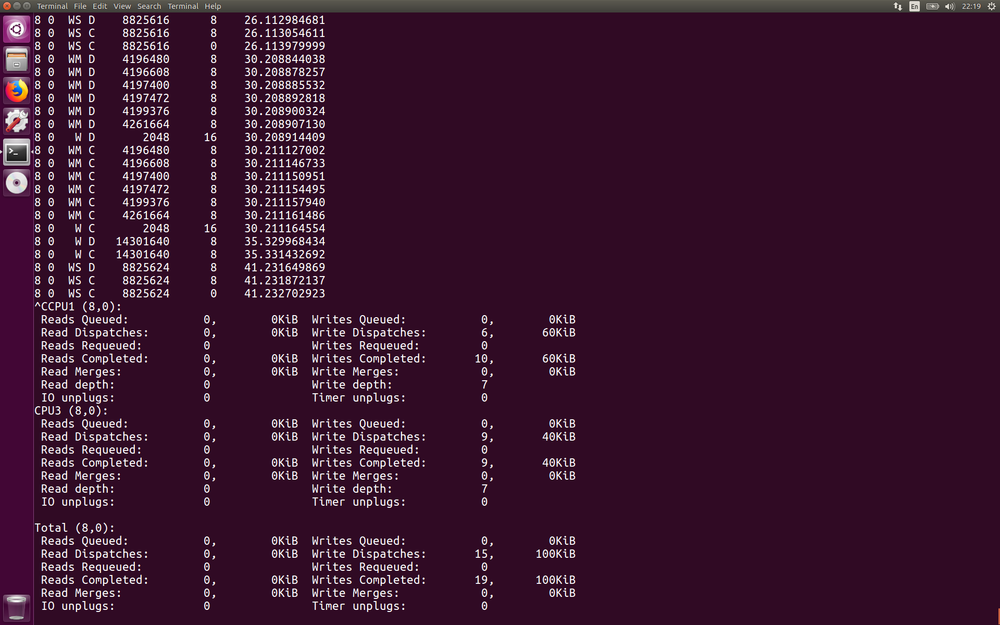
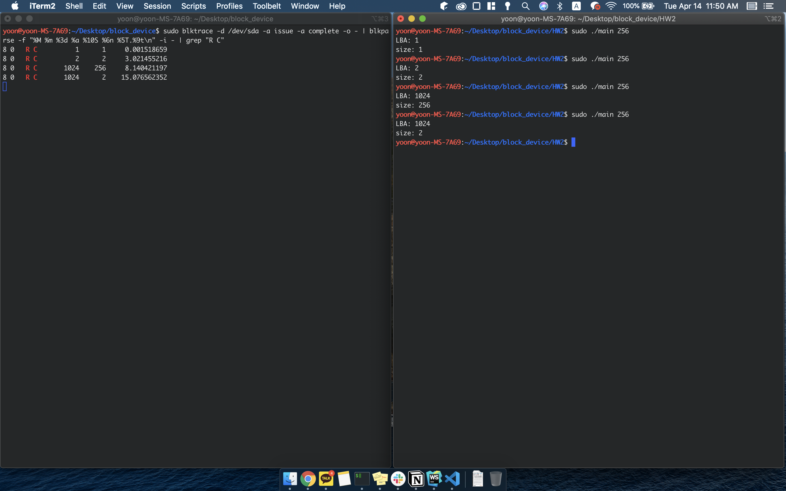

# block_device

## 과제1

`sudo blktrace -d /dev/sda -a issue -a complete -o - | blkparse -f "%M %m %3d %a %10S %6n %5T.%9t\n" -i -`

## 과제2

현재 size 를 256bytes 이상 read 하도록 시도할 때 다 읽어오지 못하는 상황이다. 문제 해결 후 다시 업로드 하겠다.

## 과제3

